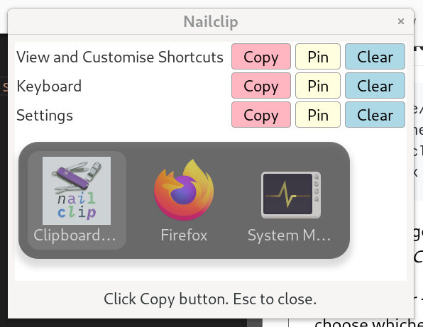

# Nailclip

Fed up with lack of decent Linux-based clipboard manager à la Windows _super + v_ pop-up. Turns out X11 systems aren't conducive to overlaying window focus owing to some security concerns...

So here's Nailclip: my extremely simple-yet-decorative Python-based clipboard manager!




## Installation

```bash
  cd /home/{YOUR_USERNAME}/.local/src/
  git clone https://github.com/euteryu/Nailclip
  cd Nailclip
  chmod +x clipboard_manager.py
```
On GNOME, go to *Settings -> Keyboard -> View and Customise Shortcuts -> Custom Shortcuts*

I prefer *super + b* shortcut to bring up clipboard manager, but you choose whichever shortcut floats your boat!

If you're a Fedora user like me, install packages:

```bash
  sudo dnf install python3 python3-gobject gtk3 xdotool
```
